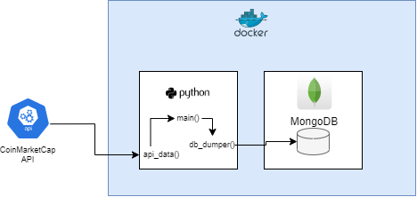
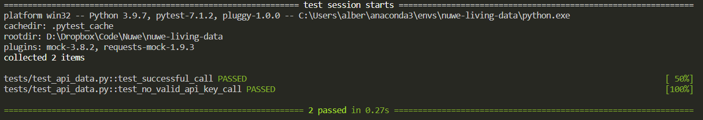
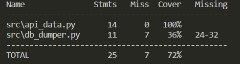

# [Living data - Nuwe](https://nuwe.io/dev/challenges/living-data)

## Sobre el desafio

Para este reto el objetivo es crear un sistema simple que permita recoger información de forma cíclica cada 15 minutos y la guarde en una base de datos.

Los objetivos y tareas que hay que cumplir:
1. Implementar la conexión con la base de datos utilizando como base el modelo de BTC de https://coinmarketcap.com/api/
2. Añadir una función que se ejecute de forma automática cada 15 minutos
3. Hacer que esta función recoja los datos de la API de https://coinmarketcap.com/api/ y actualice los datos de BTC cada 15 minutos
4. Implementar el sistema utilizando una clean architecture
5. Conseguir un mínimo del 70% en code coverage

## Solución
Como solucion se ha creado una contendor docker con un script de python que se ejecuta cada 15 minutos utilizando crontab. El script utiliza dos funciones: una que lee los datos de la API y la otra que guarda los datos de la base de datos. Como base de datos se utiliza otro contenedor con MongoDB.

## Cómo probar el código

#### Requisitos
* Docker compose
* API key de CoinMarketCap
* Conda (para los tests y cobertura de código)

La API key se debe guardar en un archivo .env con el siguiente formato:

```
API_KEY='<API_KEY>'
```

Una vez se ha configurado la API key, para iniciar el contenedor se ejecuta el siguiente comando:
```bash
docker compose up
```
Esto arrancará el contenedor con la base de datos y el script de python que se ejecutará en lo minutos 00, 15, 30 y 45 de cada hora.


#### Compobar resultados
Para poder ver los resultados guardados en la base de datos se debe acceder al docker de Mongodb. Para ello se necessita el CONTAINER ID de la base de datos que se puede obtener con el siguiente comando:
```bash
docker container ls
```
Con el CONTAINER ID y el siguiente comando se puede acceder a la base de datos:
```bash
docker exec -ti <CONTAINER ID> /bin/bash
```

Una vez se ha accedido se deben ejecutar los siguientes comandos:
```bash
mongo
use nuwe
db.coinmarketcap.find()
```
También se pueden ver los logs del contenedor que ejecuta la función de python con su CONTAINER ID:
```bash
docker container logs <CONTAINER ID>
```
#### Tests y cobertura de código
Se han programado tests sólo para la función que recoge los datos de la API. Este test hace mock con 2 respuestas de la API: una exitosa y la otra con una clave API incorrecta. Con esto se llega a una cobertura de un 72% del código en src. Si se quiere ejecutar los tests su puede hacer así:
```bash
conda env create -f env.yaml
conda activate nuwe-live-data
pytest -v
```
Esto instalará las librerias necesarias y devolverá el resultado de los tests:


Para ver la cobertura:
```bash
coverage run -m pytest
coverage report -m
```

También se puede ver la cobertura en el html generado con la funcion de coverage:
```bash
coverage html
```
